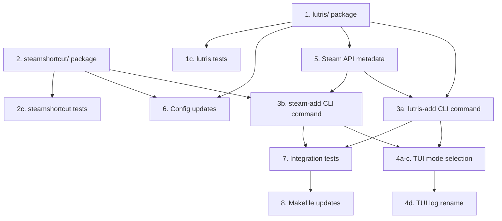

# TODO — Phase 1: Lutris Integration + Steam Shortcuts

## Goal
Implement the first new features for **gamux** (rebranded from `gbe_fork_helper`): add game executables to Lutris and optionally create non-Steam shortcuts in Steam. This establishes the two new pillars of the project alongside the existing GBE DRM-removal workflow.

## Codebase Context

- **Module**: `gbe_fork_helper` (in `go.mod`, will also need the `gamux` alias eventually — defer full rename for now)
- **Entry point**: `cmd/gbe_fork_helper/main.go` — `urfave/cli/v2` app with `apply`, `update`, `tui` commands
- **Existing patterns to follow**:
  - `steam/steam.go` — fetches app names / DLCs from Steam Store API (`config.SteamStoreAPI`)
  - `gbe/gbe.go` — walks directories, applies patches, calls `steam.FetchDLCs`
  - `util/util.go` — SHA256 hashing, file backups, archive extraction
- **Config**: `config/config.go` has global vars (`GbeDir`, `SteamStoreAPI`, etc.) and `InitConfig()`
- **Logging**: `log/slog` everywhere, TUI redirects to `gbe_fork_helper.log`
- **Error handling**: `fmt.Errorf("...: %w", err)` wrapping

---

## Tasks

### 1. Create the `lutris/` Package — YAML Installer Generation

Create `lutris/lutris.go` — a standalone package for generating Lutris game installer YAML files and registering games with Lutris.

**Lutris background**: Lutris stores game configs as YAML files in `~/.config/lutris/games/` (one per game, named `<slug>.yml`). The schema includes fields like `name`, `slug`, `game_slug`, `runner` (e.g. `wine`, `linux`), `platform`, `game` (with `exe`, `prefix`, `args`), and optional `system` (env vars, working dir). It also has a CLI at `lutris --install <yaml>` and `lutris --add-game`.

- [ ] **1a. Design the YAML schema** — inspect a real Lutris game config file (`~/.config/lutris/games/*.yml`) to confirm the exact fields. Key fields to support:
  - `name` / `game_slug` — game title, auto-generated slug
  - `runner` — `linux` for native, `wine` for Proton/Wine
  - `game` → `exe` — path to the game executable
  - `game` → `prefix` — optional Wine prefix path
  - `system` → `working_dir` — game directory (optional)

- [ ] **1b. Write `lutris/lutris.go`** with these public functions:

  ```go
  package lutris

  // GameConfig holds the user-facing parameters for a Lutris game entry.
  type GameConfig struct {
      Name        string // Game title (from Steam API or user input)
      ExePath     string // Absolute path to the game executable
      Runner      string // "linux" or "wine"
      WinePrefix  string // Optional: path to Wine prefix
      WorkingDir  string // Optional: override working directory
      AppID       string // Steam AppID (for metadata lookup)
  }

  // GenerateYAML serializes a GameConfig into a Lutris-compatible YAML string.
  func GenerateYAML(cfg GameConfig) (string, error)

  // InstallGame writes the YAML to ~/.config/lutris/games/<slug>.yml
  // and optionally runs `lutris --install <file>` to register it.
  // Returns the path to the written YAML file.
  // Accepts a dryRun parameter that only logs what would be written.
  func InstallGame(cfg GameConfig, dryRun bool) (string, error)

  // LutrisDir returns ~/.config/lutris/games/ (create if not exists).
  func LutrisDir() (string, error)

  // Slugify converts a game name to a Lutris-compatible slug (lowercase, hyphens).
  func Slugify(name string) string
  ```

  **Implementation notes**:
  - Use `gopkg.in/yaml.v3` for struct-to-YAML serialization. Add the dependency with `go get gopkg.in/yaml.v3`.
  - `Slugify`: lowercase, replace non-alphanumeric with `-`, collapse multiple `-`, trim edges.
  - `InstallGame`: write the YAML, then try to exec `lutris --install <yaml>` if the `lutris` binary is on `$PATH`. Log a warning if `lutris` isn't installed (non-fatal — the file was written so the user can import manually).
  - Follow the `util.BackupAndReplace` pattern from `gbe/gbe.go` for safe file writes, but for YAML files it's simpler — just write atomically (write to temp file, rename).
  - Follow existing dry-run conventions from `gbe/gbe.go`: `slog.Info("[DRY RUN] Would write...")`.

- [ ] **1c. Write `lutris/lutris_test.go`** with unit tests:
  - `TestGenerateYAML` — verify the YAML output contains expected keys (name, runner, game.exe, etc.)
  - `TestSlugify` — verify slug generation (spaces → hyphens, uppercase → lowercase, special chars stripped)
  - `TestInstallGameDryRun` — dry run doesn't write anything to the filesystem
  - Mock the filesystem where possible (use `os.TempDir()` for test dirs; clean up with `t.Cleanup`)

### 2. Create the `steamshortcut/` Package — Non-Steam Game Shortcuts

Create `steamshortcut/steamshortcut.go` — a package for adding non-Steam game entries to Steam's `shortcuts.vdf`.

**Steam shortcuts background**: Steam stores non-Steam game shortcuts in `shortcuts.vdf`. The format:
- **Modern Steam (2023+)**: Uses a **binary VDF** format (protobuf-based `shortcuts.vdf`). Can't be edited as plain text.
- **Classic format**: Older `shortcuts.vdf` was text-based key-value.
- **Reliable approach**: Use Steam's `-install` / grid file mechanisms OR generate `shortcuts.vdf` via the `vdf` command-line tool or manual binary parsing.

  Research this before implementing — the safest cross-version approach may be to generate a `steam://rungameid/<id>` protocol handler instead, or write to the `config/loginusers.vdf` + `config/shortcuts.vdf` pair with the binary format.

- [ ] **2a. Research `shortcuts.vdf` format** — check the Steam userdata directory (`~/.local/share/Steam/userdata/<userid>/config/shortcuts.vdf`) or the global config. Determine:
  - Is it binary VDF or text?
  - What tools exist for Go to parse/write it? (Check `github.com/andygrunwald/vdf` — text VDF only)
  - If binary, consider using a protobuf approach or shelling out to `python3` / a helper script.
  - Fallback: generate a `.desktop` file (`~/.local/share/applications/steam-<appid>.desktop`) that uses `steam://rungameid/<appid>` — this adds it to Steam's library if Steam is running.

- [ ] **2b. Write `steamshortcut/steamshortcut.go`** with:

  ```go
  package steamshortcut

  // ShortcutConfig holds parameters for a Steam non-game shortcut.
  type ShortcutConfig struct {
      Name      string // Display name in Steam
      ExePath   string // Absolute path to the executable
      AppID     string // AppID (used for grid images, etc.)
      LaunchOpt string // Optional: launch options / arguments
      StartDir  string // Optional: working directory
      IconPath  string // Optional: path to a PNG icon
  }

  // AddShortcut adds a non-Steam game shortcut to Steam's shortcuts.vdf.
  // It finds the Steam userdata directory, locates shortcuts.vdf, and
  // appends an entry. Returns an error if Steam userdata can't be found.
  // Accepts a dryRun parameter.
  func AddShortcut(cfg ShortcutConfig, dryRun bool) error

  // SteamUserdataDir returns the first non-empty Steam userdata directory
  // (~/.local/share/Steam/userdata/<numeric_id>/), or an error.
  func SteamUserdataDir() (string, error)

  // DesktopEntry writes a .desktop file to ~/.local/share/applications/
  // that launches the game. This is a fallback for when direct VDF
  // manipulation isn't available. Returns the file path.
  func DesktopEntry(cfg ShortcutConfig, dryRun bool) (string, error)
  ```

  **Implementation notes**:
  - `SteamUserdataDir()`: scan `~/.local/share/Steam/userdata/` for numeric subdirectories, pick the most recently modified one (or return first found).
  - If `shortcuts.vdf` is binary VDF, implement the binary format by reading the first few bytes to confirm the header, then use a simple append approach. Reference: [ValveSoftware/source-sdk-2013](https://github.com/ValveSoftware/source-sdk-2013/blob/master/src/public/vstdlib/binary_vdf.h) for the binary VDF spec.
  - If the binary format is too complex, fall back entirely to `.desktop` entries (which Steam picks up).
  - The `AddShortcut` dry-run should log: `slog.Info("[DRY RUN] Would add Steam shortcut", "name", cfg.Name, "exe", cfg.ExePath)`

- [ ] **2c. Write `steamshortcut/steamshortcut_test.go`**:
  - `TestSteamUserdataDir` — if running on a dev machine with Steam, verify it finds a directory; otherwise test error handling
  - `TestDesktopEntry` — verify a `.desktop` file is written with correct `Exec=` and `Name=` lines
  - `TestDesktopEntryDryRun` — confirm dry-run doesn't create files

### 3. Add New CLI Commands to `main.go`

Wire up the new packages as CLI commands.

- [ ] **3a. Add `lutris-add` command** to `cmd/gbe_fork_helper/main.go`:

  ```go
  {
      Name:      "lutris-add",
      Usage:     "Add a game to Lutris",
      ArgsUsage: "<exe_path> [--name <name>] [--appid <appid>] [--runner <runner>] [--wine-prefix <path>]",
      Flags: []cli.Flag{
          &cli.StringFlag{Name: "name", Usage: "Game name (default: inferred from executable filename)"},
          &cli.StringFlag{Name: "appid", Usage: "Steam AppID (fetches name from Steam API if --name not provided)"},
          &cli.StringFlag{Name: "runner", Usage: "Lutris runner: linux (default) or wine", Value: "linux"},
          &cli.StringFlag{Name: "wine-prefix", Usage: "Wine prefix path (for wine runner)"},
          &cli.BoolFlag{Name: "dry-run", Usage: "Show what would be done without writing anything"},
      },
      Action: func(c *cli.Context) error {
          if c.Args().Len() < 1 {
              return cli.Exit("Usage: lutris-add <exe_path> [--name ...] [--appid ...]", 1)
          }
          // Build lutris.GameConfig from flags and args
          // If --appid is provided but --name isn't, fetch name via steam.FetchAppName
          // Call lutris.InstallGame(cfg, dryRun)
      },
  },
  ```

  **Flow**:
  1. Parse `exe_path` from positional args
  2. Resolve to absolute path
  3. If `--appid` given and `--name` not given, call `steam.FetchAppName(ctx, appID)`
  4. If no name at all, use `filepath.Base(exePath)` without extension
  5. Call `lutris.InstallGame(cfg, dryRun)`
  6. On success: `slog.Info("Game added to Lutris", "name", cfg.Name, "yaml", yamlPath)`

- [ ] **3b. Add `steam-add` command** to `cmd/gbe_fork_helper/main.go`:

  ```go
  {
      Name:      "steam-add",
      Usage:     "Add a non-Steam game shortcut to Steam",
      ArgsUsage: "<exe_path> [--name <name>] [--appid <appid>]",
      Flags: []cli.Flag{
          &cli.StringFlag{Name: "name", Usage: "Shortcut name (default: inferred from executable filename)"},
          &cli.StringFlag{Name: "appid", Usage: "Steam AppID (for grid images)"},
          &cli.BoolFlag{Name: "dry-run", Usage: "Show what would be done without writing anything"},
      },
      Action: func(c *cli.Context) error {
          if c.Args().Len() < 1 {
              return cli.Exit("Usage: steam-add <exe_path> [--name ...] [--appid ...]", 1)
          }
          // Build steamshortcut.ShortcutConfig from flags and args
          // If --appid given and --name not given, fetch via steam.FetchAppName
          // Call steamshortcut.AddShortcut(cfg, dryRun)
          // Also create .desktop entry as fallback
      },
  },
  ```

  **Flow**: Same pattern as `lutris-add`, but calls `steamshortcut.AddShortcut` instead.

### 4. Expose New Features in the TUI

Extend the existing Bubble Tea TUI to offer a workflow selection screen (DRM removal, Lutris add, Steam add) instead of going straight to platform selection.

- [ ] **4a. Add a state machine transition** in `tui/tui.go`:
  - New initial state: `stateMode` — user picks: "Apply GBE (DRM Removal)", "Add to Lutris", "Add Steam Shortcut"
  - Mode selection uses the same up/down/enter pattern as the existing platform selector
  - Store the chosen mode in the model

- [ ] **4b. Add mode-specific screens**:
  - For "Apply GBE": existing platform + AppID flow (unchanged)
  - For "Add to Lutris": prompt for exe path (text input), then AppID (optional text input), then apply
  - For "Add Steam Shortcut": prompt for exe path, then AppID, then apply
  - Apply step runs the relevant operation and shows success/failure

- [ ] **4c. Wire the TUI calls** — the `applyMsg` handler should branch on the stored mode:
  - `modeApply`: call `gbe.ApplyGBE` (existing)
  - `modeLutris`: call `lutris.InstallGame`
  - `modeSteam`: call `steamshortcut.AddShortcut` + `steamshortcut.DesktopEntry`

- [ ] **4d. Update TUI log file** — rename from `gbe_fork_helper.log` to `gamux.log` in `tui.go`'s `Run()` function (since the docs now reference this name).

### 5. Extend Steam API Metadata (Infrastructure for Lutris/Shortcut)

The Lutris and Steam shortcut features need game names. Extend `steam/steam.go` to expose more metadata from the Steam Store API, making `--appid` flag usage richer.

- [ ] **5a. Add `FetchAppDetails` function** to `steam/steam.go`:

  ```go
  // AppDetails holds metadata returned from the Steam Store API.
  type AppDetails struct {
      Name        string `json:"name"`
      Type        string `json:"type"` // "game", "dlc", etc.
      IsFree      bool   `json:"is_free"`
      HeaderImage string `json:"header_image"`
      // Future: add required_age, about, short_description, etc.
  }

  // FetchAppDetails fetches full app details for a given AppID.
  // Returns AppDetails or an error if the API call fails / app not found.
  func FetchAppDetails(ctx context.Context, appID string) (*AppDetails, error)
  ```

  **Implementation**: Reuse the existing `FetchAppName` approach but broaden the filter (`&filters=basic` → no filter or `&filters=basic,price_overview`), parse more fields. For `header_image`, access `data.header_image` from the API response.

- [ ] **5b. Add `FetchGameName` helper** — refactor `FetchAppName` to call `FetchAppDetails` internally (or just call it from callers that need more than a name). Keep `FetchAppName` as a convenience wrapper for backward compat.

### 6. Update Config for Lutris/Steam Paths

Extend `config/config.go` with new configuration options.

- [ ] **6a. Add config fields**:

  ```go
  // New config vars:
  var (
      LutrisDir       = ".config/lutris/games"     // Can be overridden in config
      SteamUserdata   = ".local/share/Steam/userdata" // Can be overridden in config
  )
  ```

- [ ] **6b. Update config JSON schema** — parse `lutris_dir` and `steam_userdata` from the config file:

  ```go
  var conf struct {
      GbeDir        string `json:"gbe_dir"`
      LutrisDir     string `json:"lutris_dir,omitempty"`
      SteamUserdata string `json:"steam_userdata,omitempty"`
  }
  ```

### 7. Integration Test — End-to-End Workflow

Write a higher-level test that exercises the CLI commands with dry-run mode to verify the full pipeline works without side effects.

- [ ] **7a. Write `cmd/gbe_fork_helper/main_test.go`** — test the CLI command registration (not the side-effectful parts):
  - Verify all commands are registered (check `app.Commands` contains `apply`, `update`, `tui`, `lutris-add`, `steam-add`)
  - Verify flags are correct for each command

- [ ] **7b. Write a dry-run integration test** — create temp dirs, run `lutris-add --dry-run` and `steam-add --dry-run`, verify no files were written outside expected temp locations:

  ```go
  func TestLutrisAddDryRun(t *testing.T) {
      tmpDir := t.TempDir()
      exePath := filepath.Join(tmpDir, "game.sh")
      os.WriteFile(exePath, []byte("#!/bin/sh\necho hello"), 0755)

      // Override lutris.LutrisDir to point at tmpDir via config
      // Run the CLI with --dry-run
      // Assert no YAML was written in tmpDir
  }
  ```

### 8. Update `Makefile` Commands

Align the Makefile with the new binary name and add any new targets.

- [ ] **8a. Update binary name**: Keep `BINARY_NAME=gbe_fork_helper` for now (since `go.mod` module name hasn't changed), but add an alias or symlink:

  ```makefile
  BINARY_NAME=gbe_fork_helper
  ALIAS_NAME=gamux
  ...
  install: build
      install -d $(DESTDIR)$(PREFIX)/bin
      install -m 755 $(BINARY_NAME) $(DESTDIR)$(PREFIX)/bin/$(BINARY_NAME)
      ln -sf $(DESTDIR)$(PREFIX)/bin/$(BINARY_NAME) $(DESTDIR)$(PREFIX)/bin/$(ALIAS_NAME)
  ```

- [ ] **8b. Add `gamux` build target** — build directly as `gamux` binary:

  ```makefile
  .PHONY: gamux
  gamux: BINARY_NAME=gamux
  gamux: build
  ```

---

## Dependencies to Add

| Package | Purpose |
|---------|---------|
| `gopkg.in/yaml.v3` | YAML serialization for Lutris game configs |

Run `go get gopkg.in/yaml.v3` at the start of implementation.

## Key Risks & Decisions

1. **`shortcuts.vdf` binary format**: This is the hardest unknown. The agent should research first (check if modern Steam uses binary or text `shortcuts.vdf` on the target system). If binary format is too complex, fall back to `.desktop` entries (which Steam auto-imports) + document the limitation.
2. **Lutris CLI availability**: `lutris --install` may not be on `$PATH` — the YAML file write should always succeed; the `lutris` binary call is best-effort.
3. **Config migration path**: The config file still lives at `~/.config/gbe_fork_helper/config.json`. Adding new fields there is fine for now; a rename to `~/.config/gamux/` can happen in a later phase.
4. **Module rename**: Full rename of `go.mod` module from `gbe_fork_helper` to `gamux` is deferred — it touches every import path and would make this diff noisy.

## Execution Order



Dependency rule: complete the package (including tests) before wiring its CLI command.
